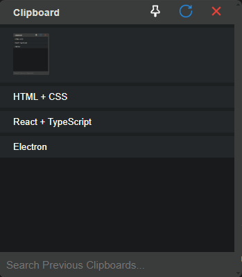

# 📋 Electron Clipboard Manager

A modern clipboard manager built with **Electron**, **TypeScript**, and **React**. This application allows users to **copy**, **cache**, **search**, and **manage clipboard history**, with support for **text and images**. Designed with productivity in mind, it also supports **pinning the app** above other windows and offers options to reset or selectively delete clipboard entries.

---

## 🚀 Features

- ✅ **Clipboard Caching** – Automatically saves copied items (text and images).
- 🔍 **Search Functionality** – Quickly find past clipboard entries.
- 📌 **Pin to Top** – Keep the clipboard window always on top of other apps.
- 🧹 **Cache Management**:
  - Clear all clipboard history.
  - Delete individual entries.
- 🖼️ **Image Clipboard Support** – View and manage copied images.
- ⚡ **Built with**:

  - Electron
  - React + TypeScript
  - HTML + CSS

  
